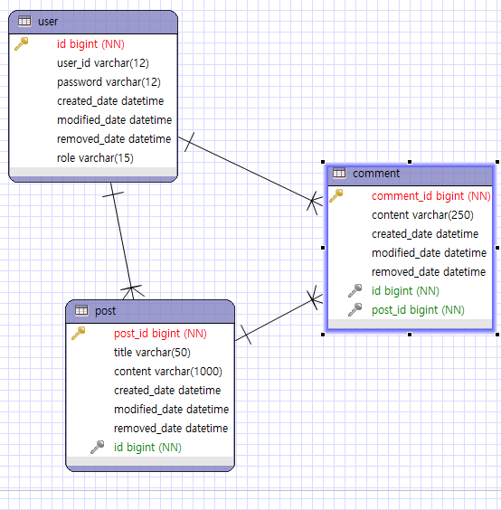

# Community
사용자들이 글과 댓글로 소통할 수 있는 게시판입니다.

# 개발 환경
- JAVA
- Spring
- MariaDB
- redis
- git
- JWT
- Swagger

# 주요 기능
- 회원 가입
  이메일 인증을 통해 회원 가입을 진행한다.
- 로그인
  고유의 아이디와 패스워드를 사용한 로그인으로, JWT를 발급받아 게시판 내 사용 권한을 얻는다.
  관리자는 제작 시 미리 만들어진 관리자용 계정을 통해 로그인하며, 게시판 전체 관리 권한을 지닌다.
- 게시판 사용
  1. 게시물, 댓글 검색 및 조회 - 별도의 로그인 없이도 검색, 조회할 수 있게 한다.
  2. 게시물, 댓글 작성 - 로그인한 사용자에 한하여 작성할 수 있게 한다.
  3. 게시물, 댓글 수정 및 삭제 - 본인이 작성한 작성물에 한하여 수정할 수 있게 한다.

# ERD

